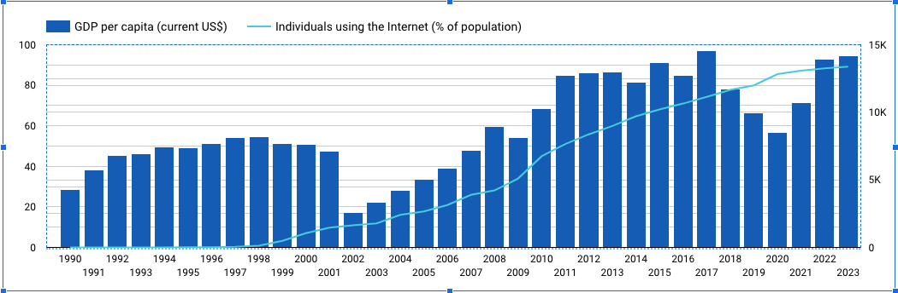

# Meli

## Challenge - Analytics Engineer

Abaixo descrevo o processo realizado para solucionar esta etapa do Challenge.

1. Analisar as fontes

   Após a verificar no site os dados disponíveis para a Argentina (https://data.worldbank.org/country/argentina?view=chart), 

   identifiquei 5 fontes que poderiam forncer informações importantes para entender o aumento do número de usuários de 

   internet no país. Estas fontes são:

   - Access to electricity (% of population)
   - GDP per capita (current US$)
   - Population, total
   - Unemployment, total (% of total labor force) (modeled ILO estimate)
   - Individuals using the Internet (% of population)

2. Transformar os dados

   Após verificar os dados de cada fonte, criei um Notebook para transformar os dados e deixá-los no melhor formato para

   análise em uma ferramenta de visualização.

   Durante a transformação dos dados, identifiquei que os dados de usuários de internet possuem informação somente a 

   partir do ano de 1990, por isso exclui os dados anteriores a este ano.

3. Ferramenta de visualização

   Optei pelo Looker Studio por ser uma ferramenta com a qual já desenvolvi alguns trabalhos pessoais e profissionais.

4. Importação do dados

   Com os dados já transformado, os importei na ferramenta de visualização.

5. Análise

   Neste ponto criei alguns gráficos para verificar a relação dos dados selecionados com o número de usuários de internet.

      - Access to electricity (% of population)

        
   
      - Population, total

        
 
      - Unemployment, total (% of total labor force) (modeled ILO estimate)

        

      - GDP per capita (current US$)

        

6. Conclusão

    Indicadores como população, energia elétrica e desemprego, apesar de estarem relacionados com o número de usuários de

    internet no país, não se mostram indicadores fortes para explicar o aumento do número de usuários. O número de usuários
    
    de internet sobe em uma velocidade muito maior do que o acesso à eletricidade e o aumento da população. Em relação ao 

    desemprego, o mesmo acontece. Mesmo em épocas de desemprego elevado, o número de usuários de internet aumenta de maneira 

    veloz. Em relação ao PIB per capita, podemos ver que existe uma forte relação, porém mesmo em períodos de queda o números de 

    usuários continua crescendo.

    Analisando todos os indicadores, concluo que conforme o país cresce (GDP) o acesso à internet aumenta, 

    porém não retrai em épocas de queda, assim como acontece mesmo com o desemprego em alta. Isto pode ser explicado 

    devido a transformação que a tecnologia impôs a sociedade. Hoje a internet é um serviço que concetra diversos outros

    serviços, como por exemplo: pagamento, comunicação, entretenimento, busca por emprego, meio de trabalho e inúmeros 

    outros. Isto explica o porque do número de usuários avançar rapidamente e mesmo se manter aumentando em épocas

    de dificuldades financeiras.

    Resumindo, a internet é hoje um serviço básico como a energia elétrica e algo a ser priorizado pelas pessoas devido a s

    características de o seu acesso substituir diversos outros serviços que antes eram independentes.

    

    
    